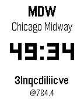

# TID clock (and other watchfaces for pebble)

## Overview

TID clock is a Pebble watchface that displays:

- The IATA code and airport name whose local time is closest to noon.
- The current time in decimal format (TID).
- Internet time (.beats).

## Prerequisites

- A Pebble watch or a compatible emulator (e.g., Basalt).
- [Rebbletool](https://github.com/richinfante/rebbletool) installed and configured.
- [Node.js](https://nodejs.org/) (for timezone data generation).
- [Bun](https://bun.sh) (for package management).

## Build & Installation

Use the included `r` helper script to streamline common tasks.
