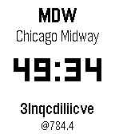

# TID clock (and other watchfaces for pebble)

## Prerequisites
- [rebbletool](https://github.com/richinfante/rebbletool)
- Python 3
- [uv](https://github.com/astral-sh/uv?tab=readme-ov-file#installation)
## Overview

TID clock is a Pebble watchface that displays:

- The IATA code and airport name whose local time is closest to noon.
- The current time in decimal format (TID).
- Internet time (.beats).

## Prerequisites

- A Pebble watch or a compatible emulator (e.g., Basalt).
- [Rebbletool](https://github.com/richinfante/rebbletool) installed and configured.
- Python 3 (for timezone data generation).


## For Python

Create a virtual environment (using [`uv`](https://github.com/astral-sh/uv?tab=readme-ov-file#installation)) and install dependencies:

```bash
uv venv
source .venv/bin/activate
uv pip install -r requirements.txt
```

## Build & Installation

Use the included `r` helper script to streamline common tasks:

```bash
# 1) Generate timezone and airport data
./r generate

# 2) Build the project
./r build

# 3) Install onto the emulator (Basalt)
./r install

# 4) Build and install in one step
./r debug
```
